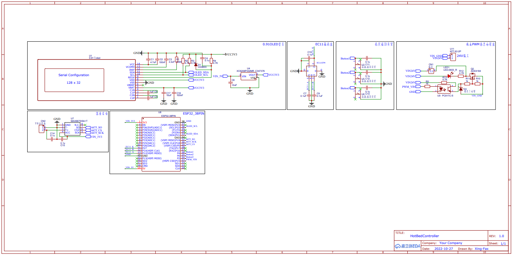

## 热床控制器

最近心血来潮的一个项目，也是学习嵌入式开始路程上的一个小Demo，同时可以帮助我轻松的焊接0805、0603、QFP以及BGA封装类的贴片元件，项目目前还在完善中，后续会添加更多功能

## 配置

- 0.91寸OLED显示屏
- EC11编码器旋钮
- 3 * Button功能按键
- 2 * 5557 2P插孔(输入/输出)
- XH2.45插孔(连接T型热电偶)
- Type-C串口调试
- 蓝牙(BT)、低功耗蓝牙(BLR)、无线射频(2.4G WiFi)
- Xtensa®32位LX6微处理器

## 功能

- PWM输出

- PID温控

- 卡尔曼滤波

- 摄氏度(℃)/华氏度(℉)切换

- 自恢复温度保险

- ###### PC上位机(待开发...)

- ###### 移动蓝牙APP(待开发...)

- ###### 智能物联网设备(待开发...)

## 使用说明

##### 设计说明：

具体可参见CSPS To ATX\Schematic\HotPlate REV1.0.pdf

##### 打样说明:

使用CSPS To ATX\Schematic\Gerber文件夹内的Gerber文件即可打样，主板为双层PCB，无特殊工艺。热床需要采用铝基板工艺，整板开窗喷锡

##### 主板固件:

在CSPS To ATX\HotBedController文件夹内包含此项目的所有代码，基于 PlatformIO 平台

##### 其他:

文档待完善...
