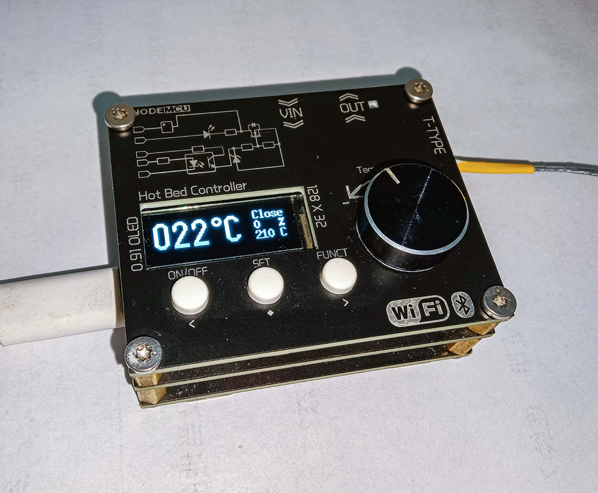

## 热床控制器

最近心血来潮的一个项目，也是学习嵌入式开始路程上的一个小Demo，同时可以帮助我轻松的焊接0805、0603、QFP以及BGA封装类的贴片元件，项目目前还在完善中，后续会添加更多功能

## 配置

- 0.91寸OLED显示屏
- EC11编码器旋钮
- 3 * Button功能按键
- 2 * 5557 2P插孔(输入/输出)
- XH2.45插孔(连接T型热电偶)
- Type-C串口调试
- 2.4GHz WiFi 802.11 b/g/n
- 蓝牙 v4.2 BR/EDR 和 BLE
- 2 * Xtensa®32位LX6微处理器
- 200W发热板，24V/8A

## 功能

- PWM输出
- PID温控
- 卡尔曼滤波
- 摄氏度(℃)/华氏度(℉)切换
- 自恢复温度保险
- PC上位机(待开发...)
- 移动蓝牙APP控制(待开发...)
- 智能物联网设备(待开发...)

## 使用说明

#### 设计说明：

屏幕方面采用了0.91寸的OLED屏幕12864驱动SPI总线，用于呈现数据

MOSFET采用了AOD4184，40V，50A，足以应对加热板控制，防止MOSFET击穿对主板照成的损坏，所以采用了光耦隔离驱动

最重要的温度检测方面采用了MAX6675，该芯片具有冷端补偿以及将K型热带偶转数字化，具备12位ADC的输出，采样精度位0.25°C，测温范围0 - 1024°C

具体可参见Schematic/HotPlate REV1.0.pdf

#### 打样说明:

使用Schematic\Gerber文件夹内的Gerber文件即可打样，主板为双层PCB，无特殊工艺。热床需要采用铝基板工艺，建议整板开窗喷锡(不然高温阻焊层会冒烟)

#### 主板固件:

项目文件夹内包含此项目的所有代码，基于 PlatformIO 平台
